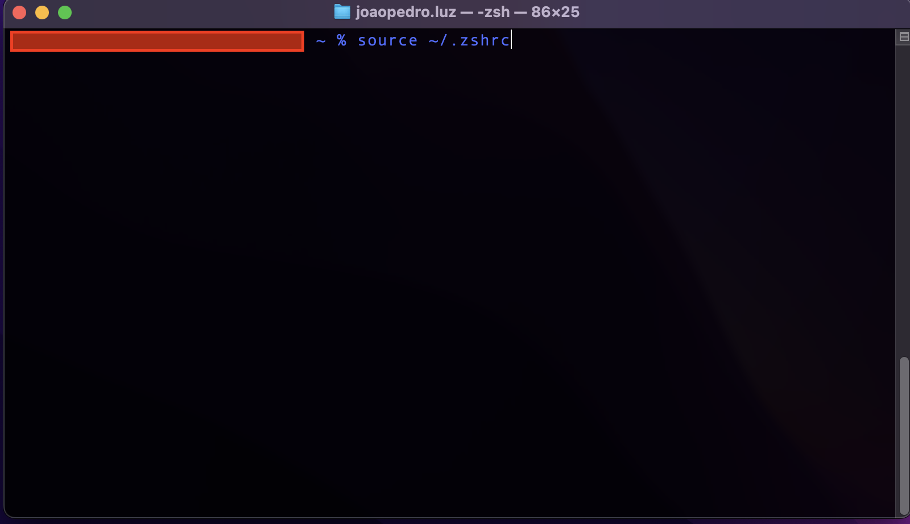

## 2.1 Ambiente MacOS

### Java

Para iniciar será necessário que você faça a instalação do Java, é muito simples de se instalar. O link é <a href="https://www.java.com/pt_BR/download/">esse aqui </a>. Clique em download gratuito do Java e faça a instalação normalmente como qualquer software.

#### JDK (Java Development Kit)

O Java Development Kit é um pacote disponibilizado pelo Oracle que permite o desenvolvimento em **Java**. O link para download está provido <a href="https://www.oracle.com/br/java/technologies/downloads/">aqui</a>, você precisará saber se seu computador é 32 ou 64 bits, com isso, você seleciona a instalação que é compatível com seu computador e instala como um programa normalmente.

### Variavel de ambiente

Para setar a variavel de ambiente você deverá fazer o seguinte:

<ul>
    <li> Após a instalação descrite acima abra o terminal e digite o comando de com o terminal que estiver usando.</li>
    <ul>
      <li>Se for bash <b>./bash_profile</b></li>
      <li>Se for zxh <b>./zshrc</b></li>
    </ul>
    <li>Abra o vim de acordo com o terminal que estiver usando.</li>
    
    <li>Pesse o comando como na foto abaixo. (O caminho de instalação pode variar em algumas versões do MacOS)</li>
    
    <li>Após salvar as mudanças e fechar o vim, rode o seguinte comando para efetivar as mudanças.</li>
    
    <li>Se tudo deu certo, rodando esse comando deve retorna algo parecido com isso</li>
    
    
</ul>

Ir para: [2.4 Editor e inicio](4-Editor-e-inicio.md)
