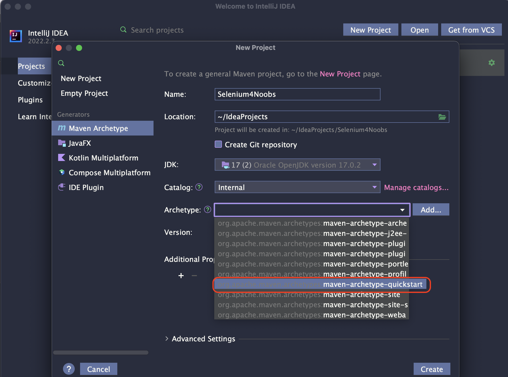
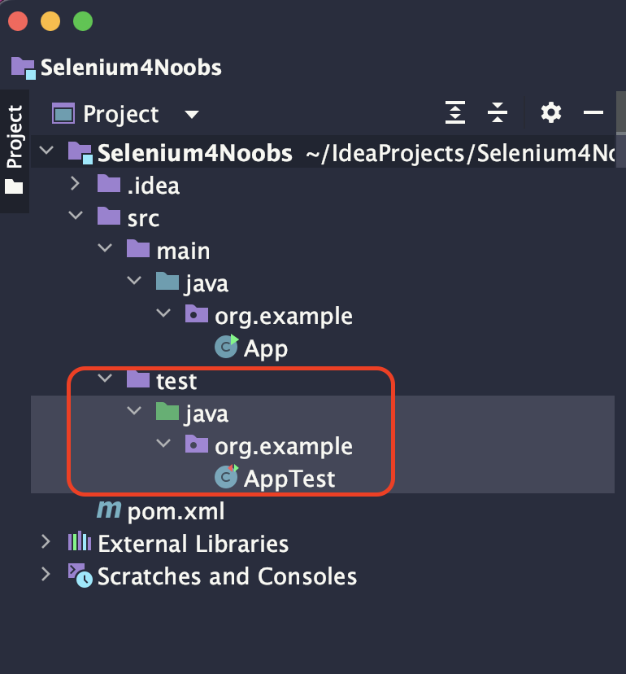
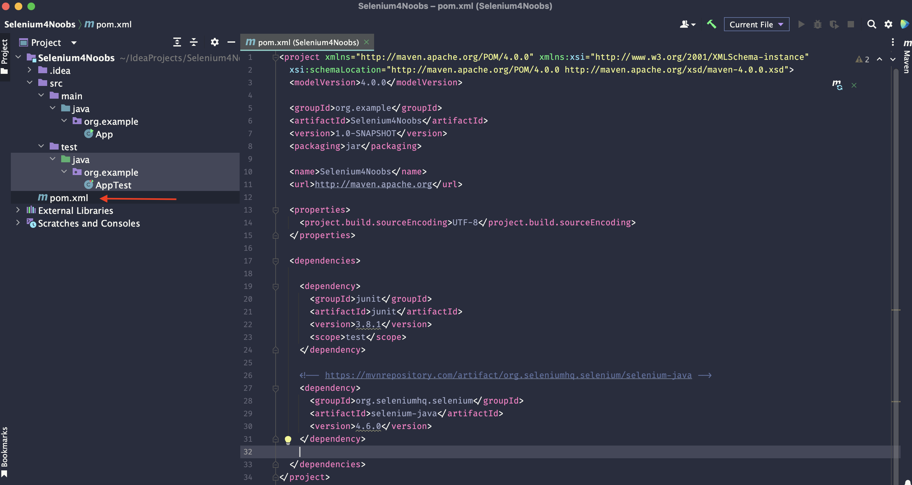
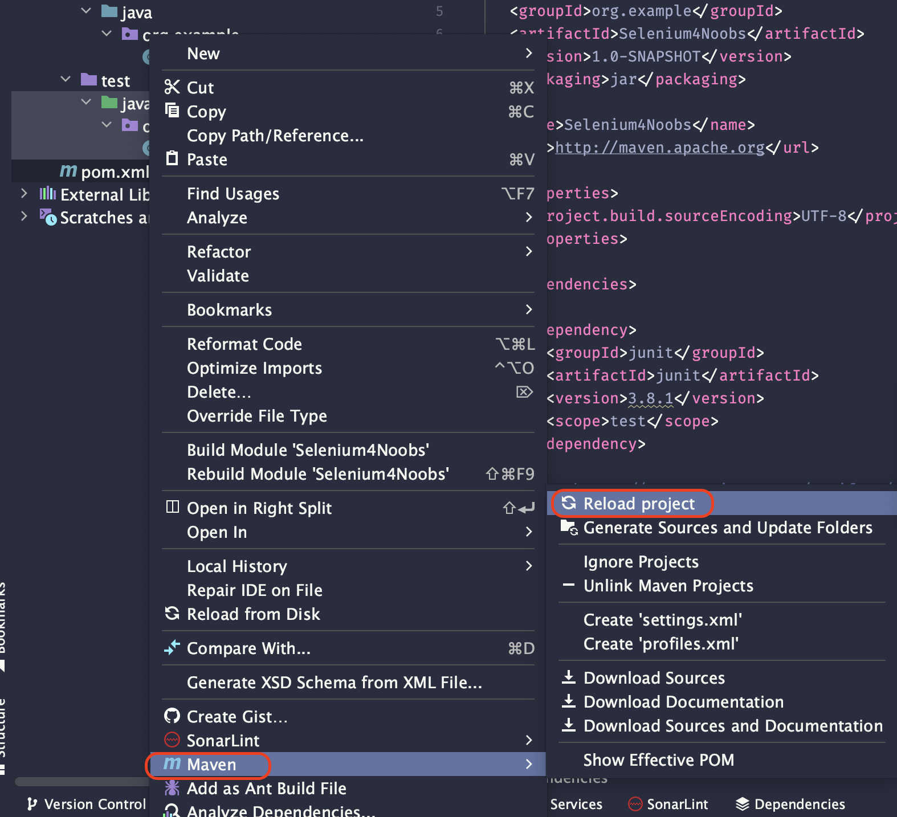

## 2.4 Editor de Texto

Como a abordagem do curso será a parte básica do Selenium com Java, recomendo a ultilização da IDE Intellij para realizar os códigos que serão apresentados ao longo do curso.

O Intellij ajuda na hora de criarmos um projeto simples com o Maven como vou mostrar daqui a pouco.

### Intellij

<a href="https://www.jetbrains.com/idea/download/"> Clique aqui para fazer o Download </a>

Instale a versão **Community Edition**

**Não é necessaário instalar nenhum plugin**

### Dando start no projeto

Vamos iniciar um projeto Maven simples.

Mas o que é o Maven?

Maven é um dos gerenciadores de pacote para o Java

<ul>
    <li>Ao clickar novo projeto, selecione projeto Maven simples como na image.</li>
    
    <li>Com o projeto criado, a arvore de folders deve ficar como na imagem. (Vamos trabalhar abaixo do folder test/java)</li>
    
</ul>

### Instalndo dependências

Agora só precisamos de duas dependência para iniciarmos.

Com projetos Maven todo pacote que precisar você encontra no <a href="https://mvnrepository.com">Maven Repository</a>.

<ul>
    <li>O primeiro pacote o <a href="https://mvnrepository.com/artifact/org.seleniumhq.selenium/selenium-java">Selenium</a></li>
    <li>Pode ser que seu projeto já seja criado com esse pacote, caso não adicione o <a href="https://mvnrepository.com/artifact/junit/junit">JUnit</a>, executaremos os testes através dele.</li>
    <li>Adicionando essas no pom.xml ele deve ficar assim.</li>
    
    <li>Agora dê um refresh no pom.xml, clicke com botão direito maven->Reload project</li>
    
</ul>

Agora estámos prontos

Ir para: [Dicas gerais](./5-Dicas-gerais.md)