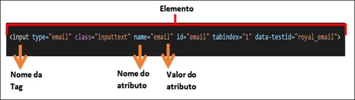
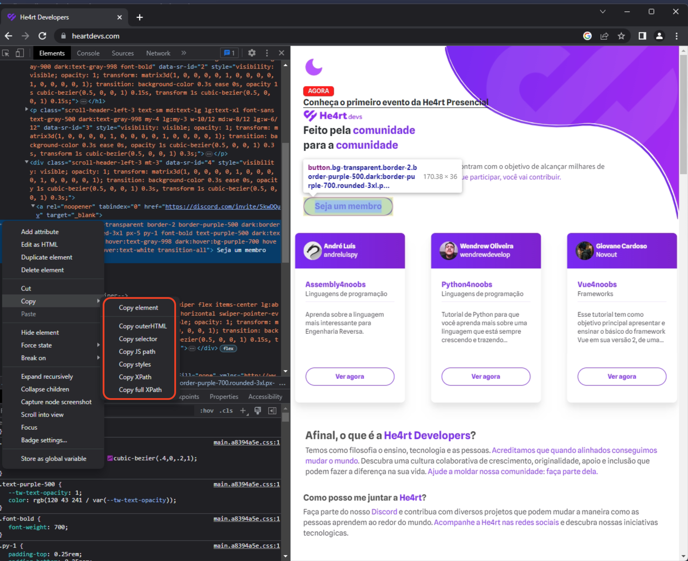

# 3.1 - Locators

A primeira coisa que precisamos aprender é buscar elementos corretamente. Existem ainda algumas ferramentas que auxiliam nessa inspeção por elementos.

Inspecionando as páginas web, devemos localizar um elemento e enviar um comando para que ele execute uma ação, seja em qualquer linguagem.

Para interagir com o elemento devemos acha-lo primeiro. Vamos conhecer alguns locators.

## Conhecendo um a estrutura de um Elemento

PPrimeiro temos que saber o que é um elemento antes de captura-lo, já sabemos que existem várias possibilidades de busca, seja ela por um valor, um conteúdo, uma tag, um atributo, todo esse conjunto forma um elemento, e dentro desse elemento que podemos realizar nossa busca para interagir.

O que forma esse elemento é uma estrutura ou bloco de códigos, mas individual para cada elemento dentro da tela, para que possamos interagir com eles e fazer o mapeamento correto, não se desespere quando não encontrar uma cadeia de códigos com o formato bonitinho, sempre tem uma solução.
<ul>
     
</ul>

## ID

Localizar um elemento pelo “ID” é a maneira mais fácil e segura, os elementos com id são menos propensos a alterações do que outros elementos. Podemos identificar os id’s através do # (sharp,hash).

Exemplo Funcionais:

**Elemento**
```html
<input type="email" class="inputtext" id="email" tabindex="1" data-testid="royal_email">
```

**Seleção por ID**
```Java
findElement(By.id("email"));
```

## Class

Localizar um elemento pelo atributo “class”, é comum possuir vários elementos que representam essa busca na mesma linha. Podemos identificar as classes através do . (ponto final).

**Elemento**
```html
<input type="email" class="inputtext" id="email" tabindex="1" data-testid="royal_email">
```

**Seleção por Class**
```Java
findElement(By.className("email"));
```

## Xpath

Muito se ouve falar desse tipo de inspeção, a quem defenda e quem condene, mas ainda sim um último recurso válido em meio ao caos do desenvolvimento. Por vezes pode trazer uma estrutura limpa como um monte de sujeira, dependendo do copiador de xpath utilizado, mas a dica é usar somente em último, para dar mais confiança ao código e uma manutenção mais fácil.

**Elemento**
```html
<input type="password" name="pass" class="inputtext" id="email" tabindex="1" data-testid="royal_email">
```

**Seleção por Xpath**
```Java
findElement(By.Xpath("//*[@id='pass']"));
```

## CSS

Funciona como um xpath, pode ser utilizado como uma estrutura também ou um quebra galho, pois é propenso a mudanças em algumas aplicações web. Ele vai copiar e priorizar se na estrutura possui um #id ou uma chave fixa que ele possa usar.


**Seleção por CSS**
```Java
// Campo de pesquisa do google
findElement(By.cssSelector("body > div.L3eUgb > div.o3j99.ikrT4e.om7nvf > form > div:nth-child(1) > div.A8SBwf > div.RNNXgb > div > div.a4bIc > input"));
```

## Inspeção de elementos

A melhor e mais fácil maneira de conseguir seleconar e pegar o locator desejado, e pela ferramenta de inspeção de elementos, que esta presente nos browsers.

É só selecionar o elemento, clickar com o botão direito do mouse e copiar o tipo de locator.


Ir para: [3.2 WebDriver](2-WebDriver.md)
