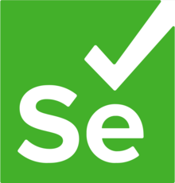

# Selenium4Noobs

<h1 align="center">
  
</h1>

Tutorial De Selenium para iniciantes em automação de testes.

  

## ROADMAP

### Introdução

1. [Boas Vindas](/1-Introducao/1-Boas-vindas.md)
2. [Comunicação](/1-Introducao/2-Comunicacao.md)

### Configuração de Ambiente

1. [Ambiente MacOS](/2-Ambiente/1-Ambiente-macos.md)
2. [Ambiente Windows](/2-Ambiente/2-Ambiente-windows.md)
3. [Ambiente Linux](/2-Ambiente/3-Ambiente-linux.md)
4. [Editor de textos e inicio](/2-Ambiente/4-Editor-e-inicio.md)
5. [Dicas Gerais](/2-Ambiente/5-Dicas-gerais.md)

### Módulo Básico

1. [Locators](/3-Basico/1-Locators.md)
2. [WebDriver](/3-Basico/2-WebDriver.md)
3. [Abrindo navegador](/3-Basico/3-Abrindo-navegador.md)
4. [Scripts simples](/3-Basico/4-Script-simples.md)

### Módulo Intermediário

1. [Page Object](/4-Intermediário/1-Page-object.md)
2. [Driver factory](/4-Intermediário/2-Driver-factory.md)
3. [Espera implícita e explícita](/4-Intermediário/3-Espera-implicita-e-explicita.md)
4. [Injeção de JavaScript](/4-Intermediário/4-Injecao-de-javascript.md)

## Como Contribuir

Contribuições fazem com que a comunidade open source seja um lugar incrível para aprender, inspirar e criar. Todas contribuições
são **extremamente apreciadas**

1. Realize um Fork do projeto
2. Crie um branch com a nova feature (`git checkout -b feature/featureBraba`)
3. Realize o Commit (`git commit -m 'Add some featureBraba'`)
4. Realize o Push no Branch (`git push origin feature/featureBraba`)
5. Abra um Pull Request

## Autores

 <b>João Pedro Luz</b> - _Quality Analyst Engineer & Menber of He4rt Developers_
  
  <a>
  

Made with 💜

## Contribuidores ✨

Nosso obrigado vai pra essas pessoas incríveis ([emoji key](https://allcontributors.org/docs/en/emoji-key)):

Este projeto segue a especificação [all-contributors](https://github.com/all-contributors/all-contributors).
Contribuições de qualquer tipo são bem-vindas!
